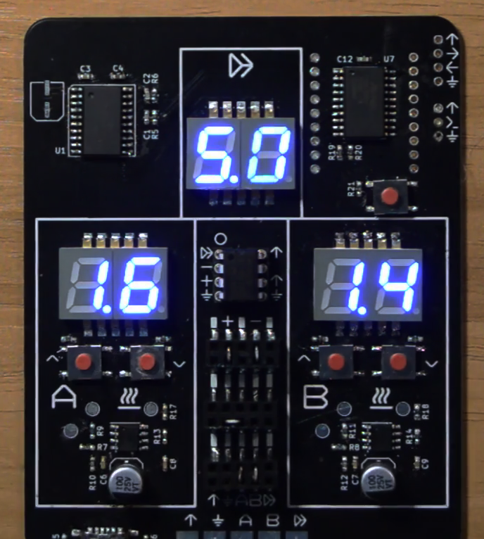

# Amper

I'm unprivating my amper project for posterity. At time of writing, a lot of the code looks commented out and it's been like two years so I dare not go back in now. It's got two basic functions:

1. A learning tool for Op-Amps allowing you to set two voltage rails and create a circuit on the breadboard-like arangement of headers in the middle.
2. A (somewhat bad) dual rail switch mode lab supply

1 worked relatively well. Turns out pin headers are designed more for du-pont style pins than resistor or capacitor legs.

Regarding 2, This project taught me a lesson: don't use a microcontroller to manage power rails unless you really know what you're doing. There are many things which can raise input impeadance too fast for a UC to notice, and then the rail will spike to supply voltage.

